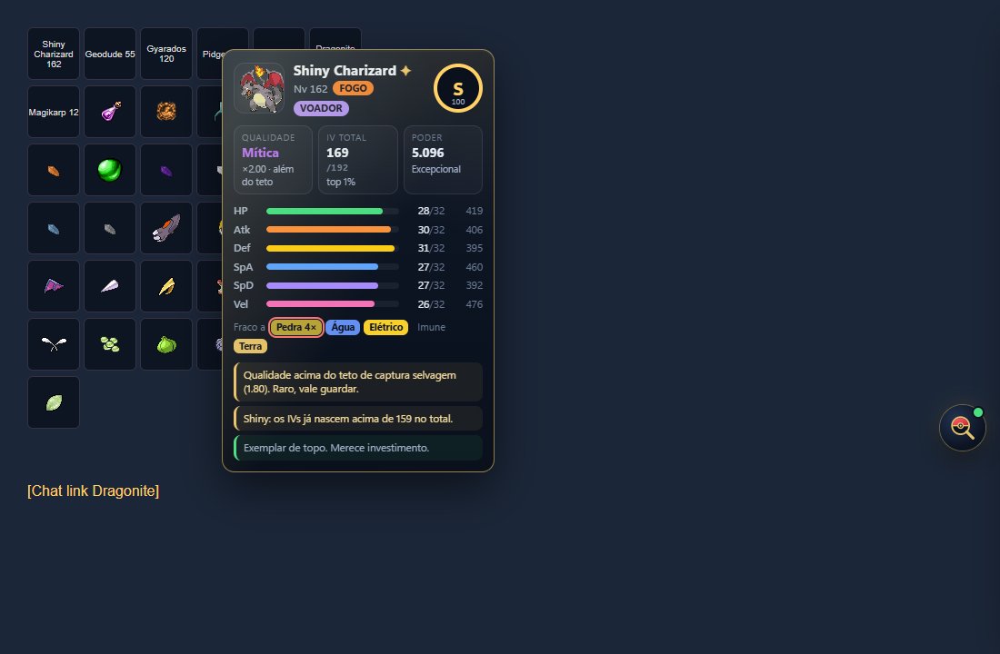
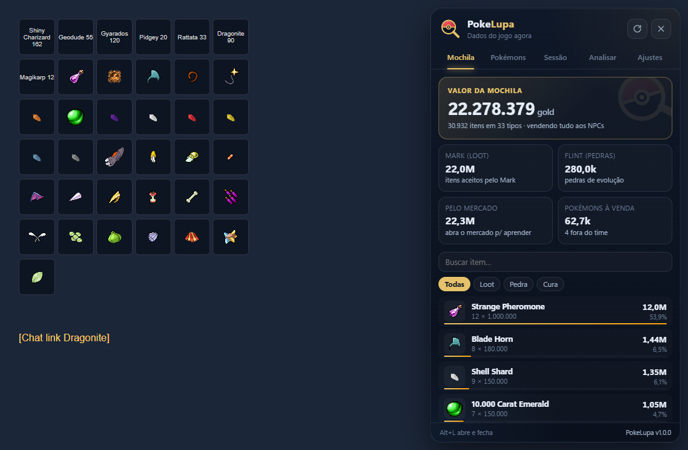

<p align="center">
  
</p>

<h1 align="center">PokeLupa</h1>

<p align="center">
  Extensão e site para <b>Poke Idle World</b>: IV por atributo, qualidade e nota de cada Pokémon só de passar o mouse, valor da mochila e loot por hora.
</p>

<p align="center">
  <a href="https://skymerlight.github.io/pokelupa/"><b>Site e analisador por print</b></a> ·
  <a href="https://skymerlight.github.io/pokelupa/download/pokelupa.zip"><b>Baixar a extensão</b></a>
</p>

<p align="center">
  
  
</p>

## O que ela faz

| | |
|---|---|
| 🔎 **Cartão no mouse** | Em qualquer Pokémon da mochila, time, chat ou mercado: IV de cada atributo, qualidade, nota de S a D, poder e fraquezas. Em itens: preço no NPC, total, preço de mercado e quem dropa. |
| 💰 **Valor da mochila** | Lê a mochila inteira direto do jogo (sem print e sem rolar a tela) e soma tudo pelo preço do Mark e do Flint. Quando você abre o mercado ela aprende o menor preço de cada item. |
| 🗺️ **Hunts** | Mede cada hunt separada (XP/h, loot/h, lucro/h, kills/h, drops e Pokémon usado, inclusive a forma do Ditto). Sair para a cidade ou trocar de hunt fecha o trecho, então a média não se mistura. Filtro por região e busca por nome. |
| ⏱️ **Loot por hora** | Conta o que entrou na mochila durante a sessão e calcula quanto isso rende por hora. Vender itens não atrapalha a conta. |
| 🏆 **Ranking** | Seus Pokémons ou os anúncios do mercado, do melhor para o pior (ou o contrário), com busca por nome e filtros de raridade, IV e qualidade. No mercado ainda ordena por custo-benefício. |
| ⚔️ **Contra** | Digite o Pokémon da hunt ou do boss e veja quais dos seus (e quais espécies do jogo) ganham dele, com o golpe que vão usar e o golpe que vão levar. |
| ✨ **Alerta de shiny** | Aviso e som quando aparece shiny no seu mapa, com histórico. |
| 🛡️ **Abas Clã e Profissão (não vender)** | Lê a missão do seu próximo rank de clã e as receitas de berries direto do jogo. Esses itens saem do valor da mochila e ganham um aviso na Loja do Mark (vermelho se você marcar para vender). Dá para guardar 🔒 (a Loja do Mark não deixa marcar para vender, nem pelo "Selecionar tudo") ou ignorar 🚫 qualquer item. As chaves **Travar automaticamente** nas abas Clã e Profissão travam sozinhas todos os itens da missão e os ingredientes das berries. Antes de vender algo reservado, a PokeLupa pede confirmação. |
| 🤝 **Banco de missões de clã** | O jogo só mostra a missão do seu próximo rank. Quem usa a PokeLupa envia a sua com um clique e todo mundo passa a ver os itens de todos os ranks. |
| 🏷️ **Nota na Loja do Mark** | Na aba Pokémon da loja, cada Pokémon mostra a nota S–D ao lado. |

Atalho: **Alt+L** abre e fecha o painel dentro do jogo.

## Instalação (1 minuto, sem programa nenhum)

1. Baixe o [**pokelupa.zip**](https://skymerlight.github.io/pokelupa/download/pokelupa.zip) e extraia (botão direito → *Extrair tudo*).
2. Abra `edge://extensions` (ou `chrome://extensions`).
3. Ligue o **Modo do desenvolvedor**.
4. Clique em **Carregar sem compactação** e escolha a pasta `pokelupa`.
5. Abra o jogo. O botão da lupa aparece no canto direito.

Funciona em Edge, Chrome, Brave e Opera.

### Atualizar

A extensão avisa quando sai versão nova (no painel e no ícone). Clique em **Atualizar agora**: na primeira vez ela pede para você escolher a pasta `pokelupa` e permitir editar; depois disso, cada atualização é um clique. Ela baixa a versão nova, troca os arquivos e recarrega sozinha.

## Como a nota é calculada

O próprio código do jogo define as regras, e a PokeLupa usa as mesmas:

- Cada IV é sorteado de **1 a 32** (total de 6 a 192).
- A qualidade segue uma tabela de chances: ~34% das capturas saem entre 1,00 e 1,10, e acima de **1,80** só com breeding, shiny ou evento.
- Atributo final: `stat = round(nível/100 × (base + 2·IV) × qualidade^exp)`, com `exp = 0,95` para HP e Velocidade e `0,8` para os outros.
- Poder: `round(soma dos stats × qualidade)`.

Invertendo a fórmula dá para achar o IV exato de cada atributo (a partir do nível ~50 quase sempre sai exato; em nível baixo aparece a faixa possível). A nota é o **potencial**: o poder que o exemplar teria no Nv 100, em % do melhor possível da mesma espécie (IV 192 e qualidade 1,80). Como a qualidade entra duas vezes no poder, ela pesa quase o dobro do IV, e um Lendário com IV menor passa um Épico com IV maior, como o próprio jogo explica na [Pokepédia: Power](https://poke.idleworld.online/pokepedia/systems/power) e na [Pokepédia: Qualidade](https://poke.idleworld.online/pokepedia/systems/quality).

| Nota | Potencial | |
|---|---|---|
| **S** | 75%+ | Excepcional (~0,5% das capturas) |
| **A** | 60%+ | Ótimo (~3%) |
| **B** | 45%+ | Bom (~15%) |
| **C** | 33%+ | Mediano |
| **D** | abaixo de 33% | Fraco |

Para comparar espécies diferentes, o Ranking também ordena por **Poder no Nv 100**.

## Segurança

- Só **lê** o que o jogo já envia para o seu navegador. Não clica, não caça, não vende e não troca nada por você.
- Não pede senha e não manda dados para nenhum servidor. Preferências ficam no armazenamento local do navegador.
- Permissões: `storage` e acesso apenas a `*.idleworld.online`.
- Baixe somente deste repositório.

## Estrutura

```
extensao/          a extensão (é esta pasta que vai no .zip)
  conteudo/        escuta.js lê o jogo, painel.js desenha a interface
  nucleo/          fórmulas e cartão, usados também pelo site
  popup/           janelinha do ícone da extensão
index.html, site/  site com analisador por print (OCR roda no navegador)
ferramentas/       atualizar-dados.mjs e empacotar.py
download/          pokelupa.zip pronto para baixar
```

Para atualizar os dados do site: `node ferramentas/atualizar-dados.mjs`. Para gerar o .zip: `python ferramentas/empacotar.py`.

---

Projeto de fã, sem ligação com o Poke Idle World ou com a Nintendo/Game Freak. Sprites de Pokémon: [PokeAPI/sprites](https://github.com/PokeAPI/sprites).
